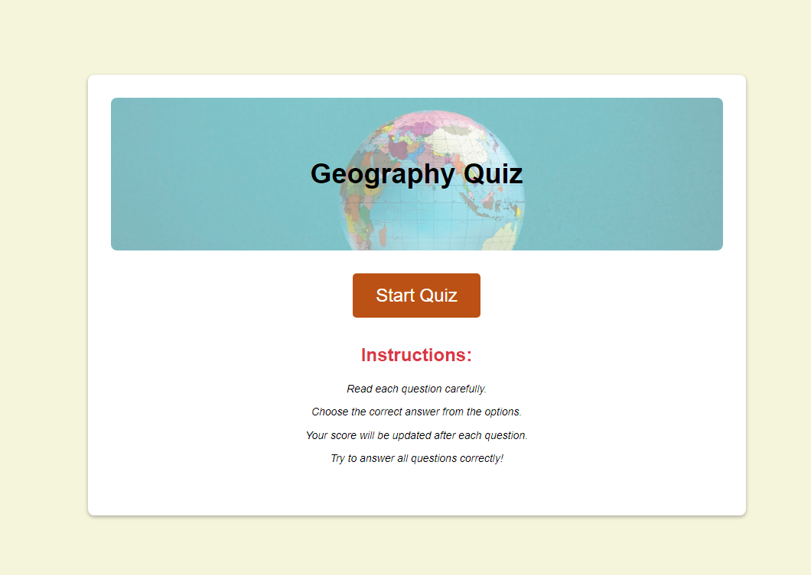
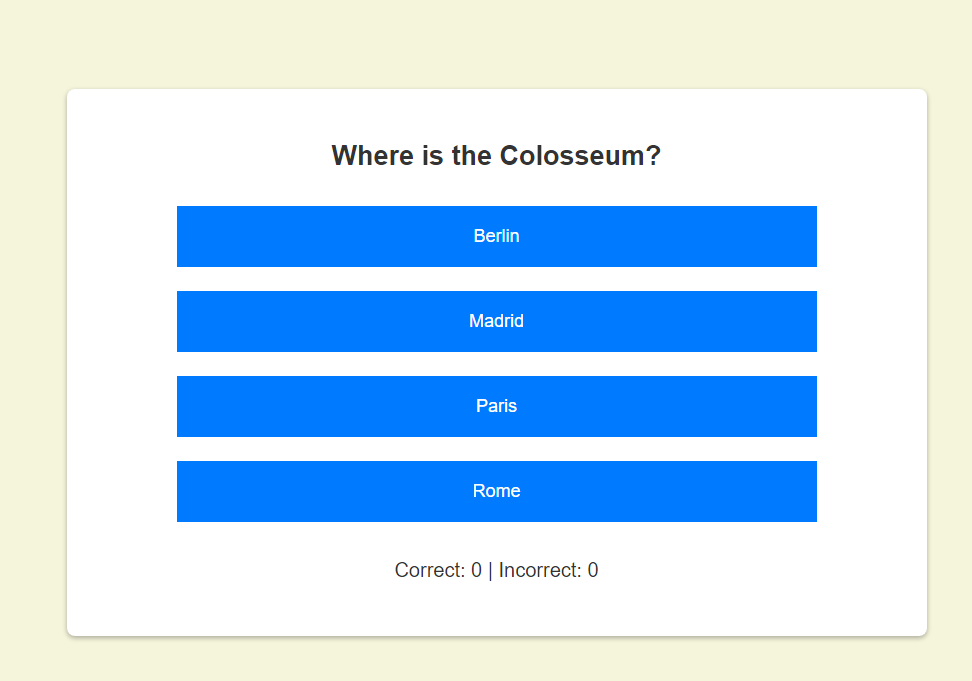
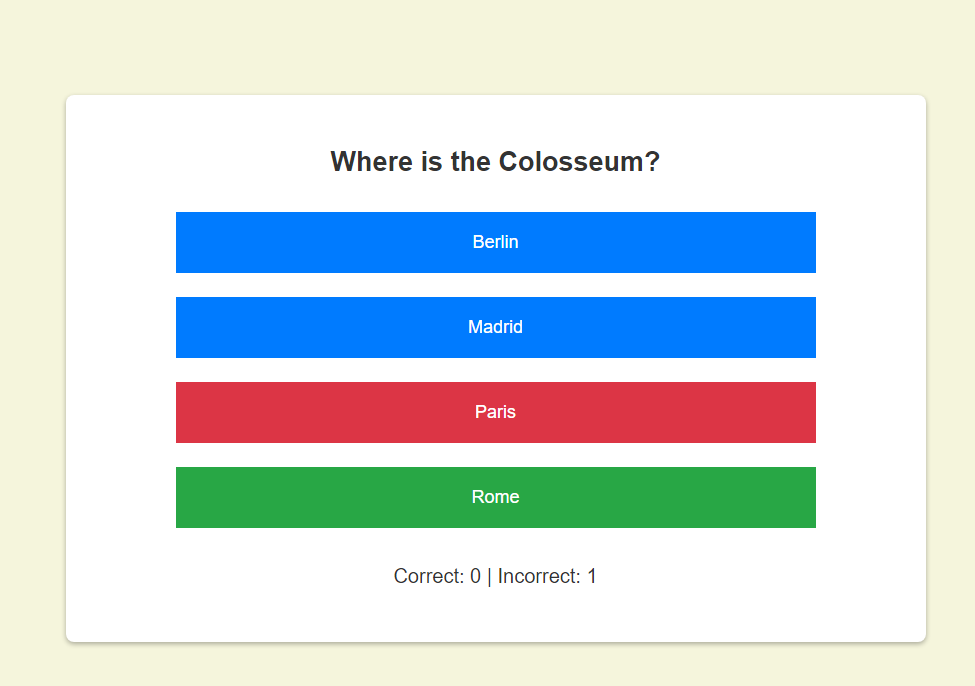
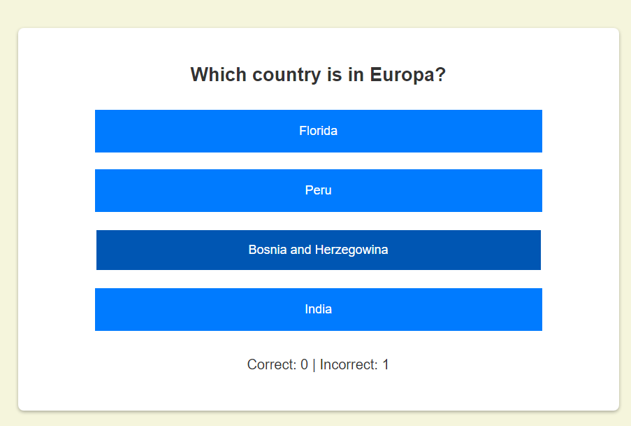
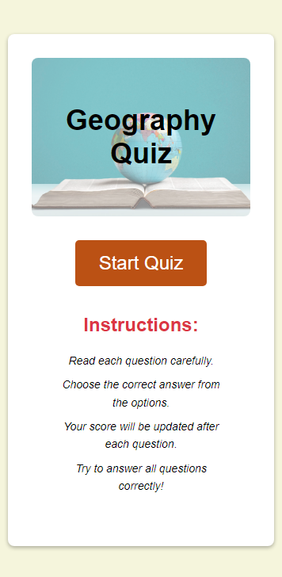
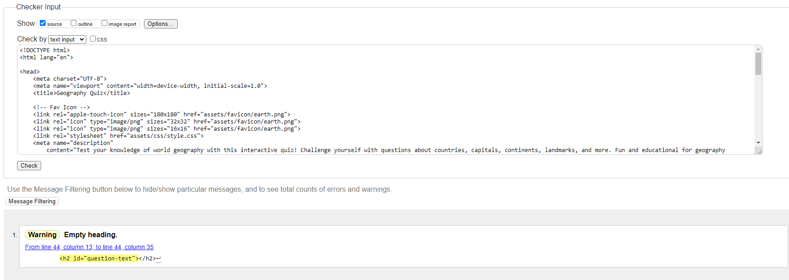
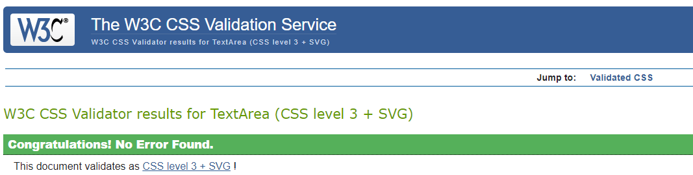
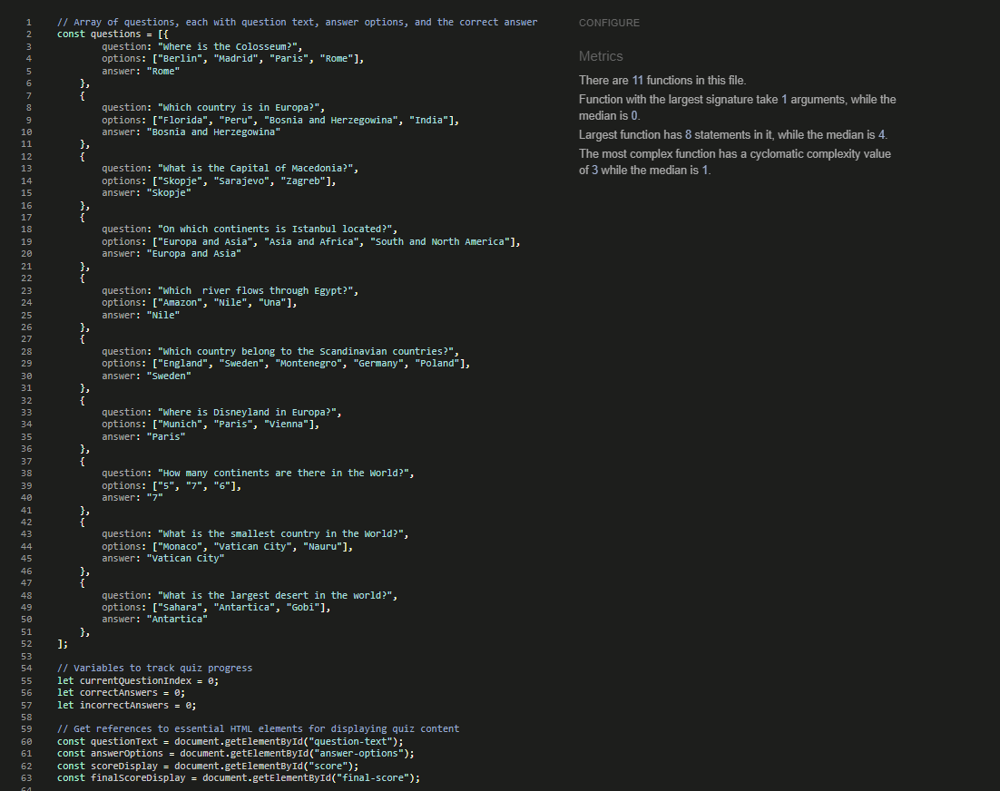
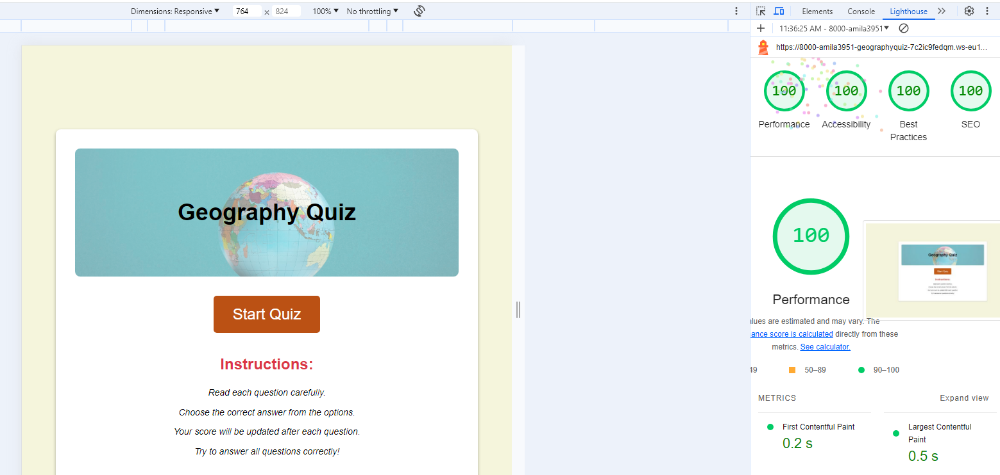

# Geography Quiz

This is a fun and interactive geography quiz designed to test your knowledge of the world. It covers a wide range of topics including countries, capitals, landmarks, and more. The quiz is built using HTML, CSS, and JavaScript, providing a seamless and engaging experience.

### First-time user goals

- Geography quiz is designed to test users knowledge in a fun and interactive way.
- Users are aware of the multiple-choice format, instant feedback, score tracking, and restart/exit options.
- User has instructions how to play quiz, answer questions and trak score points.

## Features

### Fist page / Start page

 Home page includes:
- The title "Geography Quiz" with a background image of a globe symbolizing geography.
- Button "Start Quiz", by clicking which you start the quiz and open the questions.
- Instructions part with clearly written instructions for playing the quiz.

## Questions & Answers
#### Answering Questions
- Multiple Choice Format: Each question presents a set of multiple-choice answer options.
- Click to Select: Users click on the button corresponding to their chosen answer.

**Instant Feedback:**
- Correct Answer: If the selected answer is correct, the button turns green to provide positive reinforcement.

- Incorrect Answer: If the selected answer is incorrect, the button turns red, and the correct answer is highlighted in green.

- Score Update: The score display (showing the number of correct and incorrect answers) updates immediately after each answer selection.

#### Hover Effects
- Visual Cue: When hovering over an answer button, the button changes color slightly to indicate it's interactive.
- No Premature Reveal: The hover effect does not reveal whether an answer is correct or incorrect before it's selected. This maintains the challenge and prevents accidental hints.

#### Progress and Navigation
- Automatic Progression: After a brief delay (one second) following an answer, the quiz automatically advances to the next question.
- Final Score: When all questions are answered, the quiz ends, and the final score screen is displayed.
- Restart and Exit: The final score screen provides options to restart the quiz or exit back to the beginning.

### Responsive Design
The site is designed to be fully responsive, adapting to various screen sizes and devices.

#### Mobile View (Samsung Galaxy S8+)

### Design and Validation Tools

Various tools and validators were used to ensure the site is well-designed and compliant with web standards.

#### Color Palette
A consistent color palette was chosen to maintain a cohesive look throughout the site: 
- Neutral background color with highlighted letters in stronger colors

### Validation
#### HTML Validation
- The HTML code was validated to ensure compliance with web standards.
- The console log displays a single warning due to the < h2 > element being initially empty. This element is dynamically populated with the current quiz question during runtime as the user progresses through the quiz.

#### CSS Validation
- CSS code was validated to ensure compliance with web standards.

#### JavaScript Validation

 - This JavaScript code has been validated using JSHint and passes all checks.
 - No errors or warnings were found.

 

### Lighthouse check

- Lighthouse audits confirm that this website delivers an exceptional user experience, excelling in performance, accessibility, best practices, and SEO, resulting in a flawless score across all metrics.

### Techonogy used
- **HTML**: Structure of the web pages.
- **CSS**: Styling of the web pages, including responsive design for various screen sizes.
- **JavaScript**: Interactive features (buttons, answer selection, score tracking).
- **Favicon**: Globe icon for the website.

### Deployment
- The site was deployed using GitHub Pages.
- The repository can be found at: https://github.com/Amila3951/geography-quiz.git
- The deployed site can be found at:

#### GitHub Deployment
- Login or Sign Up to GitHub.
- Open the project repository.
- Navigate to "Settings" on the navigation bar under the repository title.
- Click on "Pages" in the left-hand navigation panel.
- Under "Source", choose which branch to deploy (Main or Master).
- Choose which folder to deploy from, usually "/root".
- Click "Save", then wait for the page to be deployed.
- The URL is displayed above "Source".

### Meta information
- **Description**: "Test your knowledge of world geography with this interactive quiz! Challenge yourself with questions about countries, capitals, continents, landmarks, and more. Fun and educational for geography enthusiasts of all ages."
- **Keywords**: "geography, quiz, Test, game, countries, world, destinations, knowledge"

### Favicon
- [Favicon](https://www.flaticon.com/search?word=globe)

### Images
- Globe Image: [iStock Photo](https://www.istockphoto.com/de/fotos/world-rules)

## Credits
The score tracking feature in this application was inspired by the implementation found in the "Love Maths" project. The code is adapted and refined the score tracking logic to align with the specific requirements of a geography quiz.